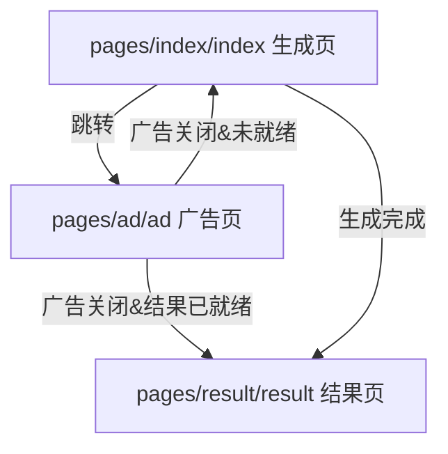
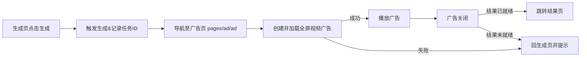

## 产品概述

在生成古诗流程中新增全屏视频广告页（pages/ad/ad），用户从生成页进入广告，全屏播放官方视频广告并使用测试位 adUnitId。关闭广告后，根据生成结果状态跳转回生成页或结果页，确保流程衔接顺畅。

## 核心功能

- 全屏视频广告页：加载官方全屏视频广告，使用测试 adUnitId，并处理加载、播放、失败、关闭等事件。
- 生成页联动：生成页（pages/index/index）触发跳转广告页，广告完成后按状态返回。
- 结果页联动：如果广告关闭时生成结果已返回，跳转结果页（pages/result/result）；否则回生成页继续生成。
- 状态传递与路由：在页面间传递生成状态、结果标识，确保返回路径正确。

## 技术栈与架构

- 小程序架构：微信小程序（原生），使用官方广告组件（全屏视频广告）。
- 状态与通信：全局/页面 data + 事件回调，路由参数携带生成状态与结果标识。
- 日志与容错：广告加载/播放失败回退生成页，记录错误码。

## 系统架构

- 模式：分层（UI 层、业务逻辑层、平台广告组件层）
- 组件关系与数据流：

## 模块划分

- 生成页模块：触发生成请求，进入广告页，记录生成状态。
- 广告页模块：初始化全屏视频广告，监听加载/播放/关闭，按状态路由。
- 结果页模块：接收结果标识并展示生成结果。
- 状态管理与路由模块：负责页面参数传递、关闭回调逻辑及错误回退。

## 关键流程

- 风格：科技感简洁 + 轻玻璃拟态，柔和渐变背景，突出广告播放区域与操作提示。
- 结构：顶部返回/关闭，主体全屏广告区域，底部状态提示和次要操作，加载/错误提示浮层。
- 交互：按钮与状态提示具备微动效，广告加载与播放态有过渡动效，关闭后有路由反馈提示。
- 响应：适配主流机型，保证全屏广告铺满，按钮触控区域充足。

## 可用扩展

- **subagent: code-explorer**
- Purpose: 快速定位并审查现有 pages/index/index、pages/result/result 以及新建 pages/ad/ad 的代码结构与路由调用。
- Expected outcome: 识别现有生成与结果流程，确保广告页接入点与路由参数正确。
- **skill-creator**
- Purpose: 如需为广告埋点或路由封装定义新技能/流程时，指导创建或更新技能。
- Expected outcome: 形成可复用的技能定义文档，支持后续自动化调用。