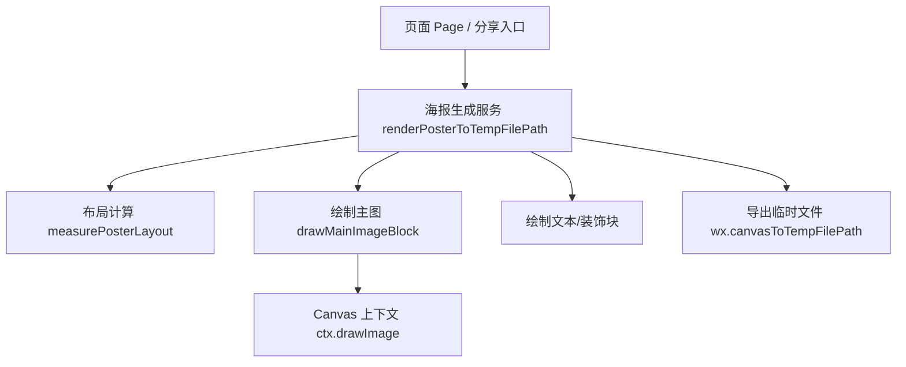
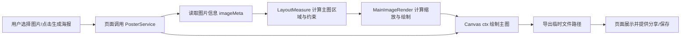

## Product Overview

用于生成分享海报的图片绘制模块，支持横构图与竖构图原图在同一模板中的自适应展示，保证主图不变形、不被不合理裁切，在不同设备和分享场景中保持稳定观感。

## Core Features

- 自动识别主图横竖构图（根据宽高比较判断）
- 竖构图主图：按约束显示宽度等比缩放高度，完整展示主体，避免被拉伸或压扁
- 横构图主图：优先填满主图区域，可根据需要适度裁切但保持比例正常
- 主图在海报中的对齐与留白优化，保证与标题、文案、边框等元素整体视觉协调
- 不同构图下海报整体尺寸、清晰度保持一致，适配分享预览与保存到相册的显示效果

## 技术选型与架构

- 前端运行环境：微信小程序
- 语言与能力：JavaScript + 小程序 Canvas 2D 绘制
- 架构模式：页面层 + 业务封装层 + 工具方法层的分层架构

### 系统架构



### 模块划分

- **PosterService 模块**
- 职责：封装 `renderPosterToTempFilePath`，组织布局计算与各绘制步骤
- 依赖：布局计算模块、主图绘制模块、其他元素绘制模块

- **LayoutMeasure 模块**
- 职责：接收画布尺寸与图片宽高，输出主图区域位置与最大显示尺寸
- 输出：包含主图框架（x,y,width,height）以及适配横/竖图的约束信息

- **MainImageRender 模块**
- 职责：根据主图区域和原图宽高，计算等比缩放后的实际绘制宽高与偏移
- 逻辑：当高度&gt;宽度（竖图）时，锁定显示宽度、按比例算高度；横图反之

- **OtherBlocksRender 模块**
- 职责：绘制标题、描述、头像、二维码等，不随主图构图变化而变形

### 数据流说明



- 数据转换要点：
- 原始输入：图片实际宽高、目标画布宽高
- 中间数据：主图区域 frame + 原图纵横比
- 输出数据：`drawImage` 使用的目标宽高与起始坐标，保证等比缩放
- 错误处理：当图片信息获取失败或宽高为 0 时，回退到默认占位图或提示重试

### 目录结构建议

```text
/Users/michael/WeChatProjects/pic2poe/
├── utils/
│   └── canvasPoster.js   # renderPosterToTempFilePath、measurePosterLayout、drawMainImageBlock 等
├── pages/
│   └── ...               # 调用海报生成的页面
```

### 关键代码结构示意

```javascript
// 关键数据结构
/**
 * @typedef {Object} ImageMeta
 * @property {number} width
 * @property {number} height
 */

/**
 * 生成海报主入口
 */
async function renderPosterToTempFilePath(options) {}

/**
 * 计算主图区域布局
 */
function measurePosterLayout(canvasSize, imageMeta) {
  const imageAspectRatio = imageMeta.width / imageMeta.height;
  // 返回 imageFrame 及纵横构图标识
}

/**
 * 绘制主图块（核心：等比缩放）
 */
function drawMainImageBlock(ctx, image, layout, imageMeta) {
  const isPortrait = imageMeta.height &gt; imageMeta.width;
  // 竖图：锁定显示宽度，按比例算高度
  // 横图：锁定显示高度，按比例算宽度
  // 计算 dx, dy, dWidth, dHeight 后调用 ctx.drawImage
}
```

### 技术实现要点

1. **纵横判断与比例计算**

- 在 `renderPosterToTempFilePath` 中计算 `imageAspectRatio` 与 `isPortrait`
- 将 `isPortrait` 明确传入 `measurePosterLayout` 与 `drawMainImageBlock`

2. **更新布局计算**

- `measurePosterLayout` 使用 `isPortrait` 调整主图框架：对于竖图适度增加上/下留白，避免画面过高导致其他元素拥挤

3. **修正主图绘制逻辑**

- 移除使用固定 `layout.imageFrame.width/height` 直接拉伸的写法
- 按原图宽高与目标约束宽/高计算缩放比例，得到最终绘制尺寸

4. **兼容横图显示**

- 横图保持现有效果：优先填充主图区域，可允许左右裁切，但绝不改变纵横比例

5. **测试与验证**

- 使用典型测试集：极端竖图（高宽比&gt;2）、普通竖图、16:9 横图、接近方图
- 在实际分享预览与保存图片中验证是否无比例失调与空白异常

### 性能与扩展

- 在单次生成中复用图片尺寸信息，避免重复调用获取接口
- 预留配置项：允许后续支持不同模板的主图宽度约束或对齐方式（居中、顶部对齐等）

## Agent Extensions

### SubAgent

- **code-explorer**
- Purpose: 在现有仓库中定位并分析 `canvasPoster.js` 内与主图布局、绘制相关的逻辑，实现精确修改。
- Expected outcome: 清晰梳理 `renderPosterToTempFilePath`、`measurePosterLayout` 和 `drawMainImageBlock` 的调用关系与当前实现细节，为实现等比缩放提供依据。