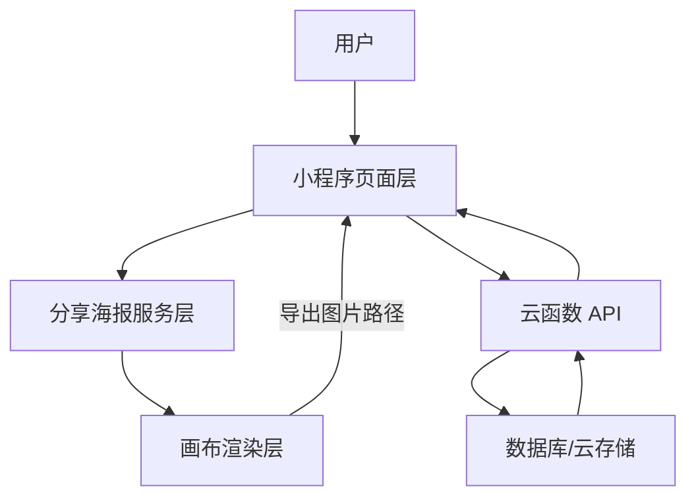
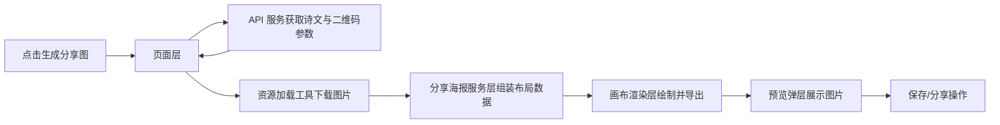

## Product Overview

基于现有微信小程序，为内容页提供本地生成分享海报的能力：在前端完成分享图排版与导出，替代原有服务端合成方案，同时保持当前页面入口与交互行为不变。

## Core Features

- 在内容详情页一键生成分享海报，包含背景、诗文、作者信息、用户头像、二维码等元素，版式协调美观。
- 生成后展示全屏预览弹层，支持长按保存或通过系统分享能力转发给好友与朋友圈。
- 海报生成过程显示加载状态与进度反馈，异常时展示错误提示与重试按钮，避免空白页面。
- 支持多种海报模板与主题样式，可根据内容类型或运营需求切换不同配色和布局。
- 对不同机型分辨率进行适配，保证文字清晰、元素不变形，整体视觉统一细腻。

## Tech Stack

- 前端：微信小程序（WXML/WXSS/JS/TS），使用小程序画布能力完成图片合成与导出。
- 后端：保留现有云开发环境，云函数仅负责生成诗文及相关业务数据，返回 JSON。
- 资源：背景图、头像、二维码等图片存储在云存储，由前端按需下载与缓存。

## System Architecture

采用前后端分离、前端主导渲染的分层结构：页面层负责交互与状态管理，中间服务层封装分享数据组装与绘制流程，渲染层专注画布绘图与导出，后端仅提供业务数据。



## Module Division

- **页面层（poem-detail、share-preview）**
- 职责：展示内容、触发生成、展示预览与操作按钮。
- 依赖：分享海报服务层、API 服务。
- 接口：`onGeneratePoster()`, `onSave()`, `onShare()`。

- **分享海报服务层（services/poster）**
- 职责：接收业务数据，生成统一的海报数据模型与布局配置，调度渲染。
- 依赖：画布渲染层、资源加载工具。
- 接口：`composePoster(data): Promise&lt;PosterResult&gt;`。

- **画布渲染层（utils/canvasRenderer）**
- 职责：根据布局配置绘制背景、图片、文字、二维码，导出临时文件路径。
- 依赖：小程序画布 API。
- 接口：`render(config): Promise&lt;string&gt;`（返回图片路径）。

- **API 服务（services/api）**
- 职责：调用云函数获取诗文和二维码参数。
- 接口：`getPoemDetail(id)`, `getPosterMeta(params)`。

- **资源加载工具（utils/assetLoader）**
- 职责：下载图片、缓存与失败重试。
- 接口：`loadImage(url): Promise&lt;string&gt;`。

## Data Flow



- 页面层发起生成请求，从 API 获取业务数据。
- 资源工具批量下载背景、头像、二维码，返回本地路径。
- 分享服务层将业务数据与布局模板合并为渲染配置。
- 渲染层按照配置依次绘制元素，导出图片路径。
- 页面展示预览，并提供保存与分享操作；错误时弹出提示并允许重试。

## Core Directory Structure

```text
pic2poe/
├── miniprogram/
│   ├── pages/
│   │   ├── poem-detail/
│   │   └── share-preview/
│   ├── services/
│   │   ├── api.ts
│   │   └── poster.ts
│   ├── utils/
│   │   ├── canvasRenderer.ts
│   │   └── assetLoader.ts
│   └── components/
├── cloudfunctions/
│   └── composeData/   # 生成诗文等业务数据
└── project.config.json
```

## Key Code Structures

```typescript
interface PosterMeta {
  title: string;
  author: string;
  content: string[];
  qrcodeUrl: string;
  bgUrl: string;
  avatarUrl?: string;
}

interface PosterLayoutConfig {
  width: number;
  height: number;
  blocks: any[]; // 文本块、图片块等布局描述
}

interface PosterResult {
  tempFilePath: string;
}

class PosterService {
  async composePoster(meta: PosterMeta): Promise<PosterResult> {}
}
```

## Technical Implementation Plan

1. **前端替代服务端合成**

- 将原 sharp/@napi-rs/canvas 合成逻辑抽象为布局配置，由前端根据配置绘制。
- 步骤：梳理原合成元素 → 设计布局模型 → 在渲染层实现对应绘制指令。

2. **资源加载与缓存**

- 统一下载背景、头像、二维码，失败重试并可降级使用占位图。
- 步骤：封装下载工具 → 支持并发队列与错误重试 → 提供缓存策略。

3. **渲染清晰度与性能**

- 在不同设备上调整画布尺寸与缩放，兼顾清晰度与绘制时间。
- 步骤：根据屏幕 DPR 计算目标分辨率 → 控制图片尺寸 → 分阶段绘制并展示加载动效。

4. **错误处理与兜底**

- 任一步骤失败时，不影响基础分享路径。
- 步骤：全链路捕获异常 → 页面统一错误提示 → 提供“只分享链接/文本”的兜底方案。

## Integration Points

- 云函数接口：通过小程序云开发 SDK 或 HTTP 调用，返回 JSON 形式的诗文与二维码参数。
- 数据格式：前端统一转换为 `PosterMeta`，避免页面层直接依赖后端字段。
- 认证：沿用现有登录与权限逻辑，确保仅在授权后获取用户头像等敏感信息。

## 设计总览

整体采用现代玻璃拟物 + 极简排版风格，突出诗文质感与海报观感。背景使用柔和渐变与轻微模糊，海报区域以卡片形式置于中央，按钮采用高对比度主色与细腻阴影，生成过程配合细微过渡与加载动效，营造流畅、高级的体验。

### 核心页面与区块

#### 页面一：作品详情 + 分享生成

1. **顶栏导航**

- 半透明背景悬浮顶部，左侧返回、右侧分享图标，小字展示作品标题，滚动时略带模糊与缩放。

2. **内容展示区**

- 大幅留白，诗文居中排版，标题加粗，作者署名靠右下，背景采用淡色渐变，营造纸张质感。

3. **分享海报入口区**

- 位于内容下方，卡片展示海报缩略图与“生成分享图”主按钮，下方提示预计生成时间。

4. **底部操作栏**

- 固定底栏，左侧是普通分享入口，右侧是高亮主按钮，按钮按压有轻微缩放与阴影变化。

#### 页面二：海报预览与操作

1. **顶栏导航**

- 显示“分享海报”标题与关闭按钮，背景半透明，与下方模糊背景融合。

2. **海报预览区**

- 居中展示大尺寸海报，四周留白，用轻微投影突出卡片；支持双指缩放查看细节。

3. **状态与提示区**

- 在海报下方显示生成状态：加载时为进度条与旋转图标，完成后展示尺寸与清晰度提示。

4. **底部操作栏**

- 三按钮布局：“保存到相册”“分享给好友”“换一张模板”，主按钮高亮，操作有水波纹与渐入渐出动画。

#### 页面三：模板选择（可选）

1. **顶栏导航**

- 标题“选择模板”，右侧“完成”，背景与其他页面一致保证统一感。

2. **模板列表区**

- 横向滑动卡片，每张展示不同配色与排版，当前选中模板有发光描边与缩放效果。

3. **预览小窗区**

- 顶部固定小预览窗，实时展示当前内容在所选模板中的效果。

4. **底部说明栏**

- 简要文字提示模板适用场景，例如“适合长诗”“适合配图”等。

### 交互与响应式

- 所有关键操作按钮提供按压反馈与短暂阴影动画。
- 海报生成时禁用重复点击，以蒙层+进度提示避免误操作。
- 在不同机型下，预览区高度按屏幕比例自适应，保持海报完整展示与操作栏可达性。

## Agent Extensions

### SubAgent

- **code-explorer**
- Purpose: 分析现有云函数与小程序代码中分享图相关逻辑、依赖与数据结构。
- Expected outcome: 得到完整的分享图调用链、数据模型与资源路径清单，为前端改造提供依据。