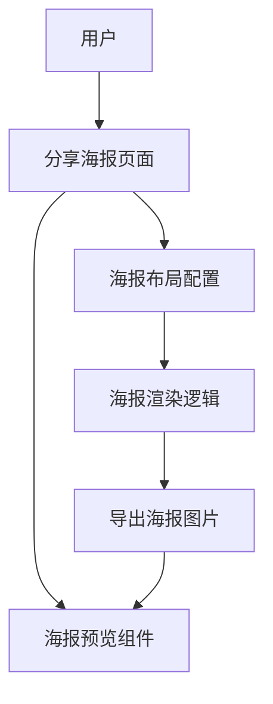
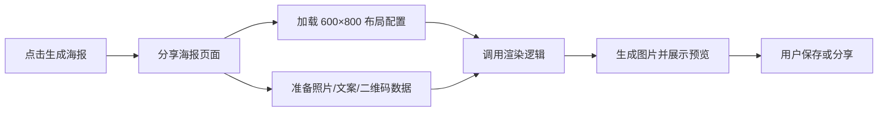

## Product Overview

Pic2Poe 分享海报模板，整体画布尺寸为 600×800，用于在小程序内生成用户作品分享图。画面需在新比例下保持主体照片、诗句文案与二维码的视觉平衡，保证在不同设备上清晰、美观、易于识别。

## Core Features

- 分享海报整体画布固定为 600×800 比例输出  
- 照片区域适配新比例，优先突出用户作品  
- 文案区域在竖向画幅中重新排布，保证阅读性与留白  
- 二维码区域去掉「拍照成诗·Pic2Poe」文案，二维码放大约 30% 并优化位置  
- 海报安全边距与导出预览同步更新，避免被裁切或遮挡

## 技术方案概览

- 前端形态：微信小程序内的分享海报生成界面  
- 架构模式：前端组件化 + 配置驱动的海报布局（布局参数集中配置）  
- 主要实现：基于画布/图片合成的 600×800 固定尺寸海报输出，无需改动服务端

## 系统架构

- 分享页面：负责触发生成、展示预览、保存/分享
- 海报配置模块：集中维护 600×800 尺寸与各区域坐标、尺寸比例
- 渲染逻辑模块：根据配置将照片、文案、二维码绘制到画布
- 资源模块：管理背景图、Logo（如有）等静态资源



## 模块划分

### 1. 海报布局配置模块

- 职责：维护 600×800 画布尺寸、照片/文案/二维码区域坐标与大小、边距
- 依赖：无（纯配置）
- 接口：提供获取当前海报布局配置的方法，例如 `getPosterLayout('600x800')`

### 2. 海报渲染逻辑模块

- 职责：按布局配置将图片、文字、二维码绘制到画布并导出
- 依赖：布局配置模块、资源模块
- 接口：`renderPoster(data, layoutConfig)`，返回可预览/保存的图片地址

### 3. 分享海报页面 UI 模块

- 职责：负责页面结构、生成按钮、预览展示、保存/分享触发
- 依赖：海报渲染逻辑模块
- 接口：响应用户点击生成，调用渲染并展示结果

### 4. 资源管理模块

- 职责：统一管理海报背景、Logo（如有）、默认占位图等资源
- 依赖：无
- 接口：按资源 key 返回资源路径

## 数据流说明



- 布局调整点：
- 画布：由原先比例改为固定 600×800
- 二维码：配置中放大约 30%，去除文案文本项
- 照片与文案：根据新高度比例重新定义区域高度和上下边距

## 核心数据结构示例

```typescript
interface RectRegion {
  x: number;  // 相对画布坐标或像素
  y: number;
  width: number;
  height: number;
}

interface PosterLayout {
  width: number;   // 600
  height: number;  // 800
  padding: number;
  photoRegion: RectRegion;
  textRegion: RectRegion;
  qrRegion: RectRegion;   // 仅二维码，不含文案
}

function getPosterLayout_600x800(): PosterLayout {
  // 内部通过 width/height 计算比例与区域
  return {} as PosterLayout;
}
```

## 技术实现要点与改动思路

1. **画布尺寸统一为 600×800**

- 问题：现有海报可能按 750×1200 或安全区约束，需统一成单一画布尺寸
- 思路：在布局配置中新增或替换为 `600×800` 布局，并统一渲染出口只读这一套参数

2. **二维码区域调整**

- 去除二维码区域下方的「拍照成诗·Pic2Poe」文案配置项
- 在布局配置中将 `qrRegion` 宽高系数放大约 1.3 倍
- 保证放大后与照片、文案区域仍然保持视觉平衡，原则：底部居中或略偏右的二维码区

3. **照片与文案重新排布**

- 在 600×800 中，建议上方为照片，中部为诗句，底部为二维码区域
- 通过调整 `photoRegion`、`textRegion` 的高度比例与上下边距，让文字保留足够呼吸空间

4. **安全边距与导出**

- 在布局配置中明确安全边距（例如左右 24px，上 32px，下 40px）
- 确保预览与最终导出图片使用同一套布局与边距，避免实际分享图被系统裁切

## 性能与兼容性

- 尽量减少重复渲染：仅在数据变更或用户点击「生成」时绘制
- 对于不同分辨率手机：使用比例/逻辑尺寸映射到实际像素，保证画面一致性

## 设计风格与布局思路

### 整体风格

- 采用现代极简 + 轻微玻璃拟态风格，突出作品与诗句，界面安静、文艺。
- 海报比例固定为 600×800，整体布局自上而下分为：作品照片、诗句文案区、二维码与辅助信息区。

### 页面规划（分享海报页面）

1. **顶部导航栏**

- 半透明白底，居中标题「分享海报」，左侧返回按钮。
- 细分割线与轻微投影，区分内容区域。

2. **海报预览区（核心画布）**

- 居中展示 600×800 预览图，背景为浅色渐变或淡纹理。
- 预览边缘有细窄阴影，形成卡片悬浮感。

3. **操作按钮区**

- 下方放置主操作按钮「保存到相册」和次级按钮「分享给好友」。
- 按钮采用圆角与渐变填充，突出主操作。

4. **底部说明与导航栏**

- 简短文字提示保存/分享方式。
- 小程序底部统一导航（如有），保持整体体验一致。

### 海报内部 600×800 结构

1. **照片区域（顶部约 55% 高度）**

- 占据上部主视觉区域，四角轻圆角。
- 背景与外层卡片留有统一边距。

2. **诗句文案区域（中部约 25% 高度）**

- 居中排版，一到三行诗句，保持充足行距与左右留白。
- 可在右下角加入小号作者标识。

3. **二维码区域（底部约 20% 高度）**

- 二维码独立占位，去除「拍照成诗·Pic2Poe」文案，仅保留二维码本身。
- 二维码相较现版本放大约 30%，保持与海报宽度和边距统一。
- 可在二维码上方用极小号文案提示「长按识别」，避免与主文案竞争视觉。

4. **背景与细节**

- 海报背景可使用轻柔渐变或浅纹理，避免抢占主体注意力。
- 使用细线与透明度区分区域，例如文案与二维码之间的细分割线。

### 交互与动效

- 生成海报时展示短暂加载动画，完成后弹出预览卡片轻微放大过渡。
- 按钮有按压缩放反馈，提升操作明确性。
- 预览图支持轻点放大查看细节，再次点击关闭。

### 响应与适配

- 页面整体为竖向布局，保证在不同屏幕高度下海报预览区域始终居中可见。
- 预览区域按 600×800 比例等比缩放，最大宽度随屏宽自适应。