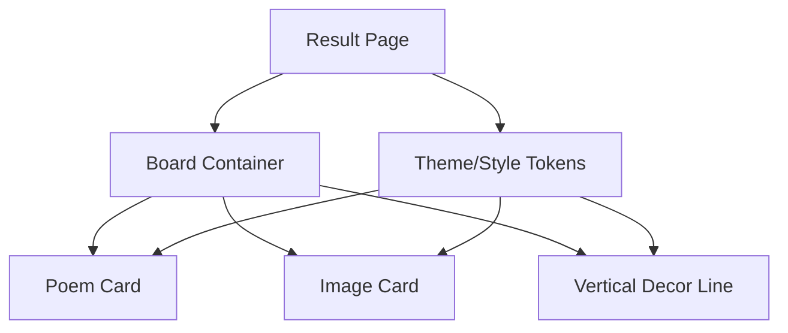
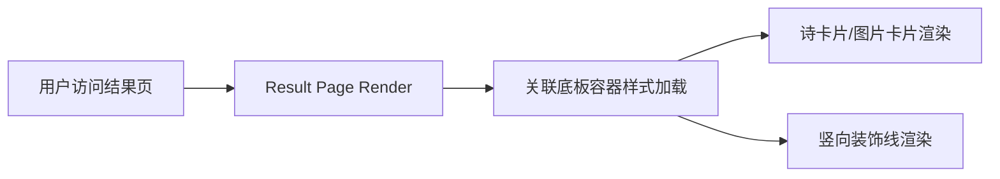

## 产品概述

结果页升级：诗卡片与图片卡片置于同一关联底板，呈现卷轴感的统一视觉，搭配暖色纸感基调与竖向装饰线。

## 核心功能

- 在 result-content 区域增加关联底板容器，承载 poem-display 与 image-block。
- 为底板添加竖向装饰线，贯穿诗卡片与图片卡片。
- 统一背景纹理、边距、圆角、阴影，保持暖色纸感。
- 适配响应式布局，保证移动与桌面显示一致的卷轴体验。

## 技术栈

- 前端：React + TypeScript
- 样式：Tailwind CSS / CSS Modules，支持纹理背景与装饰元素
- 架构：前端单体应用，组件化分层（布局容器、卡片组件、装饰元素）

## 系统架构

- 组件层：页面容器、关联底板容器、诗卡片、图片卡片、装饰线
- 状态层：布局与主题配置（暖色纸感、纹理、间距）
- 资源层：纹理背景、装饰线样式



## 模块划分

- 结果页容器：承载 result-content 布局。
- 关联底板容器：统一背景、圆角、阴影、内边距。
- 装饰线组件：竖向线条与端点装饰，可随内容自适应高度。
- 诗卡片：保持原有排版，适配新底板间距与配色。
- 图片卡片：保持现有布局，适配新底板间距与配色。
- 样式主题：暖色纸感底纹、卷轴感边框与阴影变量。

## 数据流



## 关键目录结构

```
src/
├── pages/result/
│   ├── index.tsx          # 结果页入口
│   ├── components/
│   │   ├── Board.tsx      # 关联底板容器
│   │   ├── DecorLine.tsx  # 竖向装饰线
│   │   ├── PoemCard.tsx   # 诗卡片适配
│   │   └── ImageCard.tsx  # 图片卡片适配
│   └── styles/
│       ├── board.css
│       └── tokens.css
└── assets/textures/       # 纸感纹理与装饰资源
```

## 关键代码结构

- Board：props 包含 children、padding、backgroundTexture、shadow、gap。
- DecorLine：props 包含 heightMode(auto/fixed)、gradient/solid 配置、cap 装饰。
- 主题 tokens：暖色纸感背景色、纹理 URL、圆角、阴影、线条颜色与宽度。

采用暖色纸感卷轴风格，统一大底板承载诗卡片与图片卡片，左/中位置放置竖向装饰线。圆角柔和，浅浮雕阴影，纹理背景叠加细腻噪点。布局保持充分留白与对称，对卡片间距进行统一，悬停有轻微浮动与阴影增强。响应式调整底板内边距与装饰线位置，确保移动端卷轴感不丢失。

## Agent Extensions

- **code-explorer** (SubAgent)
- Purpose: 浏览与定位 result-content、poem-display、image-block 相关代码结构
- Expected outcome: 找到结果页文件与样式入口，便于改造底板与装饰线