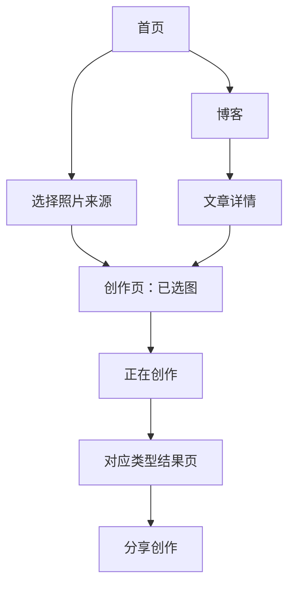

# 照片有话说｜Agent 产品规格与交接文档

> 版本：2026-08-31  
> 目的：让后续产品、设计、前端、后端或自动化 Agent 能在不依赖聊天记录的前提下，理解并持续迭代本小程序。  
> 当前可点击原型：[照片有话说-修复版静态预览.html](照片有话说-修复版静态预览.html)

---

## 0. Agent 工作约定

### 0.1 不可违背的产品原则

1. 产品服务的是“照片 + 文字表达”，**旅行是重要场景，不是产品边界**。
2. 上传一张照片即可生成；位置、照片故事、感觉都只能是选填，不能阻断生成。
3. 用户在创作页已选择生成类型，结果页应直接给出该类型的成品，**不要再用 Tab 让用户二次选择类型**。
4. 分享图应保留原图主体，不应为凑版式而粗暴裁切；宁可留白。
5. 分享图默认无水印；地点与精确位置不在分享图中展示。
6. 所有“旅行点评 / 旅行文案”统一改为“图片点评 / 配图文案”。

### 0.2 修改优先级

当设计稿、原型和旧文档发生冲突时，按以下优先级执行：

1. 用户本轮最新确认
2. 本文档的“已确认”内容
3. 当前原型的可运行行为
4. 旧决策记录与早期聊天记录

### 0.3 原型专用内容

`原型状态：未选图 / 已选图` 仅用于原型验收，**正式小程序不得展示**。正式产品应保留用户已选照片的状态，而不是每次进入创作页自动重置。

---

## 1. 产品概览

### 1.1 名称与定位

- 产品名称：**照片有话说**
- 原线上名称：拍照成诗（保留为历史功能认知，不作为整体品牌名）
- 一句话价值：让一张照片长出诗、观察与可分享的文字。
- 首页主标题：**让一张照片，长出诗和回忆。**

### 1.2 核心能力

| 能力 | 用户得到的内容 | 结果页呈现 | 分享成品方向 |
|---|---|---|---|
| 五言绝句 | 一首五言绝句 | 诗笺式排版 | 原图 + 诗歌拼图 |
| 图片点评 | 对画面与瞬间的观察 | 标题、点评、照片观察标签 | 摄影刊物式 |
| 配图文案 | 可直接发布的社交文案 | 完整文案 + 话题 | 朋友圈随笔卡 |

---

## 2. 信息架构与主要流程



### 2.1 底部导航

仅保留三项：

- 首页
- 创作
- 我的

博客作为首页“博客文章 / 更多文章”的二级页面保留，不再占用底部 Tab。

“我的”是登录后的作品展示页：顶部提供设置按钮，主体只展示微信身份信息与最近作品双列卡片，最多 8 张。首页不提供按类型筛选、创作记录、隐私或意见反馈；隐私与反馈统一放入设置页。首版不展示会员、充值、创作次数或任何权益卡片。

### 2.2 主创作链路

```text
首页上传 / 创作页上传
→ 拍照或从手机相册选择
→ 已选图创作页
→ 选择必选生成类型，按需填选填项
→ 开始生成
→ 独立 loading 文案与动效
→ 自动跳转对应结果页
→ 分享创作 / 重写 / 换图重写
```

---

## 3. 页面规格

### 3.1 首页

### 内容与文案

- 品牌：照片有话说
- 眉标：`TRAVEL · WORDS · MEMORY`（视觉装饰；后续可根据品牌再评估）
- 主标题：让一张照片，长出诗和回忆。
- Hero 文案：从光影里，找一句话；写诗 · 图片点评 · 配图文案
- 主入口：上传一张照片
- 能力标签：五言绝句 / 图片点评 / 配图文案
- 博客模块标题：博客文章
- 博客入口：更多文章 ›
- 首页不展示用户创作次数、权益、会员或付费入口；当前登录后创作免费开放。

### 交互

- 点击上传入口，直接打开底部照片来源选择器：`拍照`、`从手机相册选择`。
- 首屏主图使用 `HERO_IMAGE` 配置位；为空时显示现有占位渐变。
- 首页不应再强调“旅途”是唯一使用场景。
- 点击三项能力标签，进入创作页并预选对应的生成类型。
- 点击“更多文章”进入二级博客列表；博客不再作为底部 Tab。

### 待接入

- Hero 实图
- 首页文章：WordPress 最新文章接口

---

### 3.2 创作页

### 未选图状态

必须只显示以下内容：

- 上传占位区：添加一张照片；仅支持 JPG、PNG、WebP，单张不得超过 6 MB
- 主按钮：上传图片
- 纵向三步引导：
  1. 补充照片背后的故事
  2. 选择想生成的内容类型
  3. 生成并保存你的作品

不得显示选填表单、生成类型或“开始生成”。

### 上传校验与预处理

- 单张文件大小必须 `≤ 6 MB`；超过时不上传，提示：`图片不能超过 6MB，请重新选择。`
- 仅接受 JPG / JPEG、PNG、WebP；其他格式提示：`暂不支持这种图片格式，请选择 JPG、PNG 或 WebP。`
- 客户端只做格式、大小和基础可读性检查；服务端必须再次校验真实 MIME、文件头与解码结果，不能只信任扩展名。
- 当前 CloudBase 运行包不含 HEIC 解码插件，首版拒绝 HEIC；后续若补齐解码能力，再作为独立升级项恢复支持。
- 多帧 WebP 只读取首帧；图片无法解码、长宽为 0 或文件损坏时停止处理并提示重新选择。
- 上传成功后先完成方向修正、sRGB 转换、元数据清理和创作图派生，再允许用户开始生成。

### 已选图状态

- 上传区变为照片预览，蒙版文字：**点击更换图片**。
- 不显示“重新上传”按钮；更换图片只通过照片预览蒙版进行。
- 表单顺序固定：

| 顺序 | 字段 | 属性 |
|---|---|---|
| 1 | 需要生成的类型 | 必选、单选；默认五言绝句 |
| 2 | 这是在哪里？ | 选填、单行文本 |
| 3 | 这一刻发生了什么？ | 选填、单行文本 |
| 4 | 想要的感觉？ | 选填、单选标签：自动 / 温暖 / 安静 / 幽默 / 治愈 |

- 主操作：开始生成。
- 已选图时，开始生成应悬浮在底部导航上方，首屏可见；避免被长表单推到屏幕外。

### 数据输入契约（建议）

```ts
type GenerateType = 'poem' | 'review' | 'copy';
type Mood = 'auto' | 'warm' | 'quiet' | 'humorous' | 'healing';

interface CreateRequest {
  imageAssetId: string;        // 已完成预处理的标准创作图资产 ID
  generateType: GenerateType;  // 必选
  location?: string;
  moment?: string;
  mood?: Mood;
}
```

### 图片元数据策略

- 首版**不读取 EXIF/GPS**，不接入逆地址解析。
- 不依赖照片定位生成内容；位置由用户按需填写。
- 后续若重启 EXIF 方案：只从原图读取、仅保留粗粒度地点、不保存精确坐标、分享默认不展示。

---

### 3.3 正在创作页

### 统一行为

- 视觉分析与文字生成中展示步骤反馈。
- 当前原型：约 2.6 秒后自动跳转结果页，无需“查看生成结果”按钮。
- 用户返回或离开 loading 页时，应取消未完成的自动跳转。
- 基础动效：主视觉呼吸、步骤依次渐入、当前步骤轻微脉冲。
- 从用户点击“开始生成”起计时；等待达到 10 秒且任务仍未完成时，仅提示一次 Toast：`正在努力创作中`，任务继续执行。
- 总耗时达到 60 秒仍未成功，任务状态改为 `failed`，页面显示失败状态与“重试”按钮；迟到的模型结果不得覆盖失败状态。
- 重试沿用同一标准创作图、生成类型、地址、故事、感觉和已完成的结构化照片理解结果，不要求重新上传或重新填写。
- 重试创建新的 attempt 记录，但归属于同一创作草稿；避免连续点击产生多个并行任务。
- 失败页文案：`这次没有写完，再试一次吧。`；主按钮：`重新生成`；次操作：返回创作页。

### 失败时保留内容

| 内容 | 是否保留 | 规则 |
|---|---|---|
| 原图 | 是 | 自上传起最多保留 24 小时；用户删除草稿时立即进入删除队列 |
| 标准创作图 | 是 | 用于重试；失败草稿 24 小时内未成功则删除 |
| 缩略图 | 是 | 用于失败草稿展示；与失败草稿同步清理 |
| 生成类型、地址、故事、感觉 | 是 | 保存到创作草稿，重试直接复用 |
| 结构化照片理解结果 | 有则保留 | 已成功完成分析时直接复用，避免再次调用视觉模型 |
| 未完成或未通过校验的文案 | 否 | 不向用户展示，不创建正式作品 |
| 分享成品图 | 否 | 只有作品生成成功后才能生成 |

失败任务不会进入“我的作品”。任务成功后，创作草稿转为正式作品，标准创作图、缩略图和结果内容随作品保留。

### 类型文案

| 类型 | 标题 | 副文案 | 进行中步骤 |
|---|---|---|---|
| 五言绝句 | 正在为这一刻酝酿一首小诗 | 让画面、情绪和记忆落成五言 | 推敲诗句的节奏 |
| 图片点评 | 正在读一读这张照片 | 发现画面里值得被写下的细节 | 提炼最动人的细节 |
| 配图文案 | 正在为照片配一句话 | 把这一刻整理成可以分享的文字 | 组织自然的文字表达 |

正式实现应以实际任务状态替换原型定时器；不可在模型尚未返回时提前进入结果页。

---

### 3.4 结果页

### 共同结构

```text
返回 / 标题
原图
类型标签 + 一句结果说明
对应内容成品
次操作：重写（随类型变化） / 换图重写
主操作：分享创作
```

### 五言绝句

- 成品：标题 + 四句诗的诗笺排版。
- 次操作：`重写一首`、`换图重写`。
- 主操作：`分享创作`。
- 结果诗笺内不展示品牌署名。

### 图片点评

- 成品结构：
  - “这张照片最动人的地方”
  - 一段观点式点评
  - “照片观察”
  - 画面感 / 故事感 / 记忆感等观察标签
- 次操作文案：`换个角度`。
- **分享页目标已确认但尚未接入原型**：摄影刊物式（见第 4 章）。

### 配图文案

- 成品结构：风格标签、完整社交文案、话题标签。
- 次操作文案：`换一条`。
- 主操作：`分享创作`。
- 分享页已按“朋友圈随笔卡”接入；直接从结果内容读取，无需复制粘贴。

---

### 3.5 页面操作边界

| 页面 / 状态 | 可用操作 | 不得出现 |
|---|---|---|
| 刚生成成功的结果页 | 分享创作、同图重写、换图重写 | 类型切换 Tab |
| 历史作品详情页 | 分享创作、删除作品 | 同图重写、换图重写、开始创作 |
| 分享创作页 | 生成或补生成分享图、保存图片、发给好友、分享到朋友圈 | 修改正文、重新调用内容模型 |
| “我的”有作品状态 | 查看最近 8 张、查看全部、进入设置 | 开始创作、类型筛选、创作记录、隐私与反馈入口 |
| “我的”无作品状态 | 开始创作、进入设置 | 空的作品列表 |

分享模板升级或旧分享图缺失时，可以基于标准创作图和已保存的结构化内容重新生成分享图，不依赖原图，也不改变作品正文。

---

### 3.6 我的页

定位：登录后的创作资产页，不做权益中心或复杂设置页。

#### 页面结构

```text
页面标题「我的」 + 设置
微信头像 / 昵称（无资料时显示默认头像与默认文案）
我的作品（总数） + 查看全部
  最近作品双列卡片，最多展示 8 张：缩略图、类型、标题、生成时间
```

#### 我的作品

- 首页默认按生成时间倒序，只展示最近 8 张作品；不提供筛选。
- “查看全部”进入独立作品列表页，支持按五言绝句 / 图片点评 / 配图文案筛选。
- 点击作品卡进入独立的历史作品详情页，只提供“分享创作”和“删除作品”。不展示重写、换图重写或开始创作。
- 仅在用户从未创作过时展示空状态：`第一张照片，正在等一句话。`，并提供“开始创作”入口。
- 只要已有任意作品，“我的”首页不展示新的创作入口；用户须通过底部“创作”Tab 发起新生成。
- 当前阶段不展示创作次数、会员、充值、积分或购买入口。

#### 设置页

设置作为独立二级页，承接低频管理项：

```text
照片与隐私管理
关于照片有话说
```

“我的”首页不再直接展示创作记录、照片与隐私管理。意见反馈暂不进入首期设置页。

#### 照片与隐私管理

- 说明照片仅用于本次内容生成、作品展示和分享图合成；不公开展示原图。
- 展示相机、相册等授权状态，并可跳转微信系统设置。
- 提供“删除我的作品”入口；删除前需二次确认，删除作品及其关联创作图、缩略图与分享成品图后不可恢复。
- 提供隐私政策入口。
- **原图保存周期必须以后端实际实现为准**。未实现自动清除前，不得在前端承诺“生成后自动删除原图”。

#### 意见反馈（后续能力，暂不进入首期）

- 首期不展示反馈入口，不创建飞书多维表格、不申请飞书应用权限，也不建设反馈接口或同步任务。
- 后续启用时，采用“后端持久化 → BullMQ 异步同步飞书多维表格”的方案；飞书作为日常查看、筛选和处理入口，不建设独立运营后台。
- 预留字段：反馈编号、提交时间、状态、分类、反馈正文、截图链接、用户匿名标识、关联作品 / 任务编号、生成类型、小程序版本、设备信息、内部处理备注。
- 后续接入时，截图仍放在私有 COS，飞书只记录受控查看链接；不同步 `openid`、手机号、原图、精确位置、临时签名 URL 或模型输入输出原文。

---

## 4. 分享创作规格

### 4.1 分享页通用操作

- 页面标题：分享创作
- 主按钮：**分享到朋友圈**
- 次按钮：保存图片、发给好友
- 分享图不加水印。
- 成品优先使用 4:5 比例，兼顾朋友圈浏览与阅读。
- 正式小程序需使用平台能力保存到相册、分享给好友和分享至朋友圈；原型当前为 Toast 模拟。

### 4.2 小程序码规范

分享图均需预留小程序码，用于把朋友圈、聊天转发带回小程序创作页。二维码只作为视觉占位，正式开发时替换为携带来源与作品参数的真实小程序码。

统一规则：

- **只保留二维码**，不增加“扫码创作”等说明文案。
- 放置在**文字／诗歌纸张区域的右下角**，与边缘保留安全留白。
- 不遮盖原图、标题、正文或话题标签；二维码尺寸应随可用留白自适应，优先保证内容可读。
- 横图五言绝句：放在上方诗歌区右下角。
- 竖图／方图五言绝句：放在右侧诗歌区右下角。
- 图片点评、配图文案：放在下方米白文字区右下角。

### 4.3 五言绝句分享图

| 原图比例 | 自动排版 | 规则 |
|---|---|---|
| 横图 | 上诗下图 | 诗歌区在上、原图在下；完整保留横向风景的舒展感 |
| 竖图 / 方图 | 左图右诗 | 文字与照片并列，保证竖图不被过度裁切 |

诗歌区规则：

- 保留诗歌标题，例如“湖上晚归”；不使用书名号。
- 标题加粗、字号大于诗正文。
- 不加任何品牌水印。

### 4.4 图片点评分享图（已选方案，待接入）

采用 **摄影刊物式**：

```text
4:5 画布
上方约 58%：原图
下方约 42%：米白纸张区
  - 图片点评小标签
  - 观点式标题
  - 60 字以内点评摘要
```

原则：像一张摄影杂志的图片说明；不模拟社交平台界面；不加水印；正文不超过 60 字。

### 4.5 配图文案分享图（已接入原型）

采用 **朋友圈随笔卡**：

```text
4:5 画布
上方约 50%：原图
下方约 50%：米白文字区
  - 风格 / 场景小标签
  - 文案首句（加粗大标题）
  - 后续文案摘要（建议不超过 90~104 字）
  - 话题标签（最多 1~2 个为正式建议）
```

数据来源规则：

1. 结果页为唯一内容源。
2. 取结果文案的第一句作为分享卡标题。
3. 取剩余正文作为摘要，超长截断。
4. 从结果内容中读取话题标签。
5. 不让用户复制后再粘贴；分享页自动生成卡片。

---

## 5. 博客

### 页面规则

- 只展示最新文章列表；不做“精选文章”大卡片。
- 博客页不显示“最新文章”标题。
- 顶部“全部文章 ▾”可展开分类下拉并即时筛选。
- 保留分页结束语：没有更多文章。
- 文章详情使用原生阅读样式；底部提供“上传照片开始创作”回流入口。

### WordPress 接入契约（建议）

| 需求 | 规则 |
|---|---|
| 最新文章 | 按发布时间倒序请求 |
| 分类 | 以 WordPress 实际分类目录为准；当前生活 / 评论 / 旅行 / 播客只是原型占位 |
| 特色图片缺失 | 使用占位图 |
| 图片加载失败 | 回退到占位图 |
| 摘要缺失 | 取正文前 200 字，移除 HTML 标签 |
| 分类为空 | 显示空列表状态，不能误报“没有更多文章” |
| 分页结束 | 显示“没有更多文章” |

### WordPress REST API 设计

小程序不直接请求 WordPress，由 NestJS 作为博客网关统一请求、清洗和缓存，避免前端依赖 WordPress 原始 HTML 与字段结构。

| 场景 | WordPress 请求 |
|---|---|
| 分类列表 | `GET /wp-json/wp/v2/categories?per_page=100&hide_empty=true` |
| 最新文章 | `GET /wp-json/wp/v2/posts?_embed=1&per_page=10&page={page}&orderby=date&order=desc` |
| 分类文章 | 在文章请求中增加 `categories={categoryId}` |
| 文章详情 | `GET /wp-json/wp/v2/posts/{id}?_embed=1` |

后端对小程序提供稳定接口：

```text
GET /blog/categories
GET /blog/posts?page=1&pageSize=10&categoryId=
GET /blog/posts/:id
```

#### 字段映射与清洗

| 小程序字段 | WordPress 来源与处理 |
|---|---|
| `id` | `post.id` |
| `title` | `title.rendered`，解码 HTML 实体并移除标签 |
| `excerpt` | 优先 `excerpt.rendered`；为空则从 `content.rendered` 去标签后截取前 200 个汉字 |
| `featuredImage` | `_embedded['wp:featuredmedia'][0].source_url`；缺失或加载失败使用统一占位图 |
| `categoryIds` | `categories` |
| `publishedAt` | `date`，统一输出 ISO 8601 |
| `contentHtml` | `content.rendered` 经白名单清洗后输出 |

- 文章详情允许段落、标题、列表、引用、链接和图片；移除 `script`、`style`、`iframe`、`form`、内联事件和危险 URL。
- 外部图片统一转 HTTPS；加载失败显示占位图。超宽图片在小程序 `rich-text` 容器内限制为 100%。
- 分页以 WordPress 响应头 `X-WP-TotalPages` 为准；达到最后一页后显示“没有更多文章”。
- 分类筛选结果为 0 时显示“暂无此分类文章”，不能显示“没有更多文章”。

#### 缓存、超时与降级

- 分类缓存 1 小时，文章列表缓存 5 分钟，文章详情缓存 10 分钟；发布新文章后可通过管理端主动失效缓存。
- NestJS 请求 WordPress 超时 5 秒，网络错误最多重试 1 次。
- 首页请求失败时优先返回最近一次成功缓存；没有缓存时显示轻量失败状态和“重新加载”。
- 文章列表响应必须包含 `page`、`pageSize`、`totalPages`、`hasMore`；前端不得自行猜测是否还有下一页。
- `www.shengxiluo.me` 加入微信小程序业务域名白名单并确保 HTTPS 证书有效；若所有请求均经 NestJS 网关，前端只需配置后端 API 域名。

### 正式域名

- WordPress 博客：`https://www.shengxiluo.me`

---

## 6. 视觉系统

| Token | 当前方向 |
|---|---|
| 基调 | 温暖米白纸张感、克制红色、低饱和森林绿 |
| 主背景 | `#f7f4ed` |
| 主文字 | `#25231f` |
| 辅助文字 | `#817a70` |
| 主操作色 | `#b85c4a` |
| 强调绿 | `#52685a` |
| 正文字体 | 系统中文无衬线 |
| 标题 / 诗歌 | Georgia / 宋体风格衬线组合 |

视觉意图：照片是主角，文字像从照片里被“写出来”；避免过强科技感、重黑边、显眼水印和过多装饰性标签。

---

## 7. 技术实现建议

### 7.1 客户端与后端

- 客户端：原生微信小程序 + TypeScript。
- 后端：异步任务模式，支持模型调用、重试、状态查询。
- 图像处理：Sharp 负责方向修正、压缩与多规格派生；视觉模型和分享图均使用标准创作图，不直接读取原图。
- 正式小程序的布局使用 `rpx`；静态浏览器原型避免依赖 `rpx`。

#### 图片资产生命周期（已确认）

```text
原图上传（私有 COS）
→ Worker 生成标准创作图与缩略图
→ 标准创作图交给视觉模型，并作为分享图拼接素材
→ 生成作品与分享成品图
→ 原图自上传起保留 24 小时，到期自动删除
```

| 资产 | 定义与建议规格 | 保存策略 | 使用场景 |
|---|---|---|---|
| 原图 `original` | 用户上传的原始字节；JPG / PNG / WebP，≤ 6 MB，不修改内容 | 私有保存 24 小时，到期删除 | 解码失败排查、24 小时内重新派生创作图；不直接交给模型或分享 |
| 标准创作图 `creation` | Sharp 修正方向、转 sRGB、清除 EXIF/GPS；长边 2048 px、JPEG 质量 85；透明图片以白色背景合成 | 成功后随作品保留；失败草稿最多保留 24 小时 | 视觉模型输入、作品详情大图、分享图拼接的统一图片源 |
| 缩略图 `thumbnail` | 从标准创作图派生；长边 640 px、WebP 或 JPEG 质量 75 | 随作品保留；失败草稿与创作图同步清理 | “我的”最近作品、完整作品列表等低流量预览 |
| 分享成品图 `share` | 标准创作图 + 标题 / 正文 + 小程序码按模板合成；4:5，建议 1440 × 1800 px，JPEG 质量 90 | 随作品保留；模板版本变化可重新生成 | 保存到相册、发给好友、分享到朋友圈 |

- 原图应生成独立的到期删除任务；同时配置 COS 生命周期规则作为兜底，避免任务异常导致残留。
- 未成功转为正式作品的草稿，其原图、标准创作图、缩略图和用户输入统一以原图 `uploaded_at + 24 小时` 作为过期时间；重试不会延长保存期限。
- 用户删除作品时，应立即逻辑删除作品；由 BullMQ 异步级联删除标准创作图、缩略图、全部分享成品图、原图（若仍在 24 小时内）、生成文本与关联记录。
- 删除任务必须可重试、幂等，并记录清理状态；对象文件不存在时视为清理成功。
- 原图、创作图和分享图均为私有对象，只能通过后端签发的短期访问地址读取。

建议为每个对象建立 `image_asset` 记录，至少包含：`id`、`user_id`、`draft_id/work_id`、`asset_type`、`object_key`、`mime_type`、`width`、`height`、`size_bytes`、`expires_at`、`delete_status`、`created_at`。业务接口只传资产 ID，不传可长期访问的 COS URL。

### 7.2 模型职责（既定方向）

| 任务 | 建议模型职责 |
|---|---|
| 图像理解、图片点评、配图文案 | **Qwen3.7-Flash** |
| 五言绝句 | GLM |

模型输出应返回结构化内容，避免前端用脆弱的文本切分：

```ts
interface GenerationResult {
  type: 'poem' | 'review' | 'copy';
  imageAssetId: string;
  poem?: { title: string; lines: [string, string, string, string] };
  review?: { headline: string; body: string; observations: string[] };
  copy?: { label?: string; headline: string; body: string; hashtags: string[] };
}
```

#### 模型调用配置

模型名称、参数和 Prompt 版本必须放在服务端配置中，不得写死在小程序或业务代码。MVP 采用以下路由：

| 阶段 | 主模型职责 | 超时预算 | 失败处理 |
|---|---|---:|---|
| 照片理解 | **Qwen3.7-Flash** | 20 秒 | 网络或服务错误重试 1 次；仍失败则任务失败 |
| 图片点评 / 配图文案 | **Qwen3.7-Flash** | 20 秒 | 重试 1 次；可配置同能力备用模型 |
| 五言绝句 | **Qwen3.7-Flash** | 20 秒 | 重试 1 次；结构不合格进入定向修正 |
| 结构与内容校验 | 程序规则 + 内容安全审核 | 8 秒 | 不合格最多定向修正 1 次 |

以上为分阶段上限，整个创作任务仍受 **60 秒总超时**约束；剩余时间不足时不得继续发起新的模型调用。

> **模型选型已确认（2026-09-20）**：图片理解、五言绝句、图片点评和配图文案统一使用 `qwen3.7-flash-2026-07-15` 快照。该类单图、短提示、短输出任务通常处于 32K 输入档，优先选择其成本优势；正式请求默认使用非思考模式，避免额外时延与 Token 成本。

建议配置项：

```ts
interface ModelRouteConfig {
  provider: 'qwen';
  model: string;
  fallbackModel?: string;
  timeoutMs: number;
  maxRetries: 1;
  temperature: number;
  maxOutputTokens: number;
  promptVersion: string;
  enabled: boolean;
}
```

- 照片理解使用低随机性（建议 `temperature 0.2`）；五言绝句和文案可使用中等随机性（建议 `0.6～0.8`）。
- 每次任务记录 `provider`、`model`、`prompt_version`、输入输出 token、耗时、重试次数、安全结果和错误码，禁止记录临时签名 URL。
- 备用模型只能在相同结构化输出契约下启用；上线前以固定测试集验证质量，不允许在生产中未经验证地自动切换。
- 设置全局与单用户并发上限；MVP 建议从全局 5 个模型任务、单用户 1 个进行压测，再根据限流和成本调整。
- 错误码统一为 `MODEL_TIMEOUT`、`MODEL_UNAVAILABLE`、`INVALID_OUTPUT`、`SAFETY_REJECTED`，前端只显示对应的用户友好提示。

### 7.3 分享图生成

- 应由服务端或可控 Canvas 生成最终图片，不能依赖截屏 DOM。
- 需要读取原图宽高，根据类型与比例选择模板。
- 模板、字号、正文截断长度应由配置管理。
- 发布前检查：无水印、原图主体可见、文字不溢出、输出 4:5。

### 7.4 参考项目与推荐架构

技术路线采用“业务链路参考 `pyq-generator`、生成策略参考 `img2poem`、分享排版参考 `Moka`”的组合，而不直接复用它们的技术栈或代码。

| 参考项目 | 可借鉴部分 | 本项目的取舍 |
|---|---|---|
| `pyq-generator` | 小程序上传、风格选择、生成、历史记录的业务闭环 | 保持原生小程序与 NestJS，不引入其 Flask 后端 |
| `img2poem` | 先识别图像语义、再完成诗歌表达的两层思路 | 不使用其 Python 2 / TensorFlow 1.6 研究工程，改用当前多模态模型 |
| `Moka` | 内容数据与视觉模板分离、固定模板、高清导出 | MVP 不做自由编辑器、拖拽排版或大量模板 |

推荐链路：

```text
微信小程序上传照片与创作参数
→ COS 私有保存原图
→ Sharp 派生标准创作图与缩略图并登记资产
→ NestJS 基于标准创作图创建创作任务
→ BullMQ Worker 执行图像理解、内容生成与规则校验
→ 保存结果与任务状态
→ 按分享模板渲染 4:5 成品图
→ 小程序预览、保存、发给好友、分享到朋友圈
```

#### 统一照片理解层

三类内容不应各自直接读取照片。Worker 先产出一份结构化的照片理解结果，再交给不同类型的生成器使用：

```ts
interface PhotoUnderstanding {
  scene: string;
  subjects: string[];
  action?: string;
  mood: string[];
  visualFocus: string;
  userContext?: string;
  location?: string;
}
```

- 五言绝句：基于画面意象、补充故事、地址和氛围生成；随后用程序校验“四句、每句五字”，不合格则触发定向重写。
- 图片点评：生成“标题 + 40～80 字正文”，重点输出可见的构图、光线、瞬间与情绪观察。
- 配图文案：生成“首句标题 + 正文 + 标签”，结果直接被朋友圈随笔卡读取，无需用户复制粘贴。

这层结构化资产是后续扩展现代诗、亲子记录、节日卡片或博客配图的基础；新增能力只需添加生成器与模板，不应重做上传和任务链路。

#### 生成内容 Prompt 基本规则（强制）

以下三条必须作为三类内容 Prompt 的共同系统规则，不能只依赖生成后的关键词过滤：

1. **安全合规**：不得生成色情、暴力美化、违法犯罪指导、仇恨歧视、自伤鼓励或其他可能造成现实伤害的内容。图片或用户输入明显不适合生成时，返回结构化拒绝，不描述敏感细节。
2. **忠于画面**：只描述照片中可合理观察到的主体、场景、动作、构图、光线和情绪线索；不得虚构具体人物身份、关系、事件、地点或经历，不得根据人脸推断姓名、职业、民族、健康、政治、宗教等敏感属性。
3. **隐私与未成年人保护**：涉及人脸或儿童时使用中性、尊重且非性化的表达，不识别身份，不评价身体，不输出可能暴露住址、学校、联系方式或精确位置的信息。

统一安全输出：

```ts
type SafetyCode = 'sexual' | 'violence' | 'illegal' | 'hate' | 'self_harm' | 'privacy' | 'other';

interface SafetyRefusal {
  safe: false;
  code: SafetyCode;
  userMessage: '这张照片暂时无法生成内容，请更换一张照片。';
}
```

- Prompt 规则负责约束生成；模型返回后仍需执行结构校验与内容安全审核。
- 用户照片、创作图和生成内容不得用于训练或微调模型；这是数据治理规则，不依赖 Prompt 实现。
- 安全拒绝不创建作品，保留创作草稿供用户更换图片；不得向前端暴露模型原始审核理由或敏感内容复述。

#### 创作任务与状态

```ts
type CreationStatus =
  | 'queued'
  | 'analyzing'
  | 'generating'
  | 'validating'
  | 'succeeded'
  | 'failed';
```

- `POST /creations`：接收标准创作图资产 ID、生成类型、地址、故事与氛围，返回 `taskId`。
- `GET /creations/:taskId`：返回任务状态和成功结果；MVP 可轮询，后续可升级为 WebSocket / SSE 推送。
- `POST /creations/:taskId/retry`：校验任务已失败且没有进行中的 attempt，沿用同一草稿创建一次新尝试。
- Loading 页必须以真实任务状态驱动；静态原型中的定时跳转仅用于演示。
- 客户端建议每 2 秒轮询一次；前端 10 秒触发 Toast，服务端 60 秒执行硬超时并将任务原子更新为失败。
- 任务需要具备幂等、防重复提交、超时、失败重试和单用户频控；创建接口使用客户端生成的 `idempotencyKey`。

#### 分享图模板引擎

服务端应根据 `template + 标准创作图 + 结构化内容` 输出高清图片，小程序负责预览和调用微信分享能力。这样可稳定控制字体、清晰度、图片跨域及模板版本。

| 内容类型 | 已确定模板 |
|---|---|
| 五言绝句 | 横图上诗下图；竖图 / 方图左图右诗 |
| 图片点评 | 摄影刊物式：上图下文 |
| 配图文案 | 朋友圈随笔卡：上图下文 |

模板输出数据示例：

```ts
interface ShareCardData {
  template: 'poem-landscape-v1' | 'poem-portrait-v1' | 'review-editorial-v1' | 'copy-moment-v1';
  imageAssetId: string;
  title?: string;
  body: string | string[];
  hashtags?: string[];
}
```

### 7.5 MVP 实施顺序

1. 原生小程序创作链路与 COS 原图上传。
2. NestJS 创作任务、BullMQ Worker、任务状态和历史记录。
3. 多模态照片理解、三类生成 Prompt、五言绝句规则校验。
4. 三套固定分享图模板与服务端高清出图。
5. 微信保存相册 / 分享能力、内容安全、频控、失败重试和成本埋点。

### 7.6 微信登录与账户策略（已确认）

创作服务仅向已登录用户开放；首页和博客允许未登录浏览。不得设置独立登录首页，也不得在用户打开小程序时强制弹出登录。

#### 登录触发时机

- 用户首次点击“上传一张照片”“上传图片”或“开始生成”时，先完成登录，再继续原操作。
- 推荐触发点为首次点击上传照片：创建账户后立即返回照片来源选择器，不打断上传意图。
- 当前阶段所有已登录用户均可免费使用创作能力；不展示、扣减或校验创作次数。付费与额度策略待主体调整完成后单独设计。

#### 技术链路

```text
小程序 ensureLogin()
→ wx.login() 获取一次性 code
→ POST /auth/wechat
→ 服务端 code2Session 换取 openid
→ 按 openid 创建或查询用户
→ 服务端签发业务 access token
→ 小程序保存 token 并继续原操作
```

接口建议：

```ts
POST /auth/wechat

interface WechatAuthRequest {
  code: string;
}

interface WechatAuthResponse {
  accessToken: string;
  userId: string;
  isNewUser: boolean;
}
```

#### 资料与权益规则

- `openid` 是小程序内唯一用户标识，用于创作历史与内容归属。
- MVP 不要求头像、昵称、手机号；“我的”页优先读取微信基础资料或使用默认展示，不为补全资料额外打扰用户。
- 手机号只在客服、找回权益、特定活动通知等明确业务需要时，主动触发微信手机号授权；不得作为创作前置条件。
- 未来若需打通公众号、App 或其他小程序，再评估接入 `unionid`。

#### 安全与合规要求

- `AppSecret`、`code2Session` 调用只允许在服务端；不得放入小程序代码。
- `session_key` 不返回前端、不写入日志、不作为业务 token 使用。
- access token 必须具备过期、刷新、失效和服务端鉴权机制；登录失败应允许用户重试或返回浏览状态。
- 在小程序后台和产品内提供隐私协议，明确照片、生成结果、保存周期与删除方式。

---

## 8. 当前原型状态与待办

### 已接入原型

- 首页、创作页双状态、底部照片选择器、生成类型单选。
- 类型化 loading 文案与基础动效、自动跳转结果页。
- 五言绝句分享图自动拼版。
- 配图文案的朋友圈随笔卡，并从结果页读取内容。
- 博客下拉分类筛选、文章详情回流入口。
- 底部导航“首页 / 创作 / 我的”和“我的”作品展示初版。

### 需要优先补齐

1. 按最新规格收敛“我的”页：移除类型筛选和底部管理列表，只保留最近 8 张作品与设置入口；补历史作品详情、完整作品列表和设置页。
2. 图片点评的摄影刊物式分享图。
3. 真实照片上传、6 MB / 格式校验、四类图片资产派生与预览。
4. 真实模型任务、10 秒提示、60 秒超时、失败草稿与重试。
5. 分享、保存相册等微信原生能力接入。
6. WordPress 网关、文章分类、HTML 清洗、缓存与分页接入。
7. 用实际 WordPress 分类替换原型占位分类。
8. 移除正式版本中的“原型状态”切换控件。

### 风险提醒

- 静态原型的自动跳转只用于演示；正式版不能以固定时长判断生成完成。
- 内容要执行 Prompt 基本安全规则、结构校验与模型输出后的内容审核。
- 原图 24 小时和失败草稿 24 小时清理必须同时配置队列任务与 COS 生命周期兜底，并监控清理失败。
